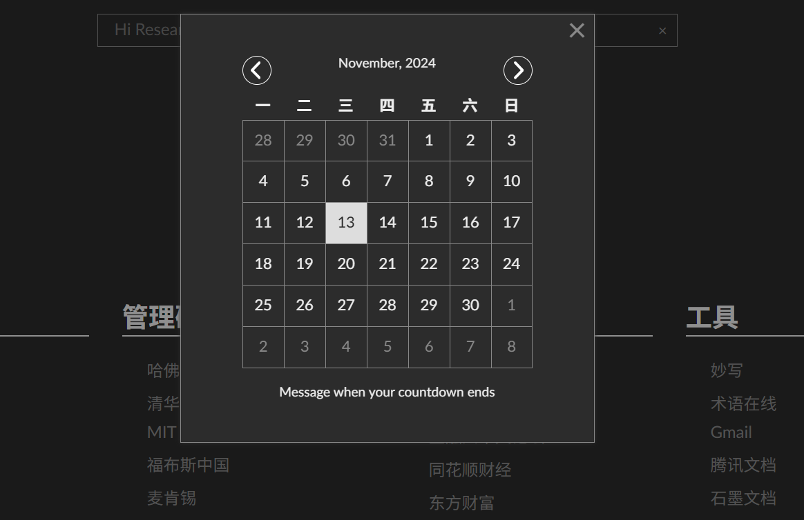

# Hi Research

参考[GreatDanton](https://github.com/GreatDanton) 项目和大邓（https://github.com/hiresearch/hiresearch.github.io）项目，丢弃庞杂丑陋的浏览器收藏夹， 打造简洁科研浏览器首页。

每个人都可以自定义自己的浏览器首页，替换默认浏览器首页/起始页。 该项目可在任何现代浏览器上运行，只需将index.html设置为主页并添加自己的链接
到index.html


<br>


# 一、功能

* 搜索(google)
* 日历(倒计时)
* 待办事项
* 支持DIY自己的首页


<br>


# 二、截图

各位可根据自身科研或者工作需要，更改成自己的标签名，替换为自己需要的网站网址


日历, 在index.html中可以设置自己认为最最重要的日子

```
<script>
	// 显示日期时钟
	showClock();

	//在日历上显示倒计时
	countDown({"y": 2022,
           	"m": 6,
           	"d": 1
           	}, "Message when your countdown ends");
</script>
```




待办事项


<br>


# 三、添加链接
网站链接需要直接加到index.html的 ``<div class="slides-container"``标签内，以学术生活如下


```html
<div class="slide" name="知行合一">
    <div class="part">
        <h1> 政策研究 </h1>
        <div class="links">
            <a href='http://www.qstheory.cn/' target="_blank"> 求是网 </a>
            <a href='http://www.people.com.cn/' target="_blank"> 人民网 </a>
     </div>
    </div>
</div>
```


# 四、使用方法
* 点击时钟，弹出日期框和倒计时信息。
* 搜索框支持`!command`搜索语法. 例如

    | 搜索框命令 | 目标网站 | 例子 | 作用 |
    | -------- | --------- | -------   | -------- |
    | !scholar | google scholar | !scholar python | 在谷歌学术中搜**python**相关信息 |
    | !book   | 豆瓣读书 | !book python | 在豆瓣读书中搜**python**相关书籍信息 |
    | !movie | 豆瓣电影 | !movie 悬崖之上 | 在豆瓣电影中搜**悬崖之上**相关电影信息 |
    | !zhihu  | 知乎 | !zhihu python | 在知乎网站搜python相关信息 |
    | !youtube | youtube | !youtube python | 在youtube搜索python相关视频 |
    | !taobao | 淘宝 | !taobao python | 在淘宝搜python相关商品服务 |
    | !jd | 京东 | !jd python | 在京东搜python相关商品服务 |
    | !bilibili | B站 | !bilibili python | 在B站搜索python相关视频 |
    | !github | github | !github python | 在github上搜python相关仓库代码等信息 |
    | !mail | qq邮箱 | !mail | 默认打开qq邮箱 |


<br>

# 五、项目代码结构
```
├── components
│   ├── calendar.js
│   ├── clock.js
│   ├── countdown.js
│   ├── notes.js
│   ├── search-box.js
│   └── slides.js
├── css
│   ├── main_min.css
│   └── main.scss
├── index.html 
```

* Components文件夹: 含有浏览器主页所需的所有组件js文件。
    * `calendar.js` -> 日历
    * `clock.js` -> 时钟
    * `countdown.js` -> 倒计时
    * `notes.js` ->待办事项todo list
    * `search-box.js` -> 主页搜索框
    * `slides.js` -> 页面滑动功能
* `index.html` -> 浏览器主页入口


